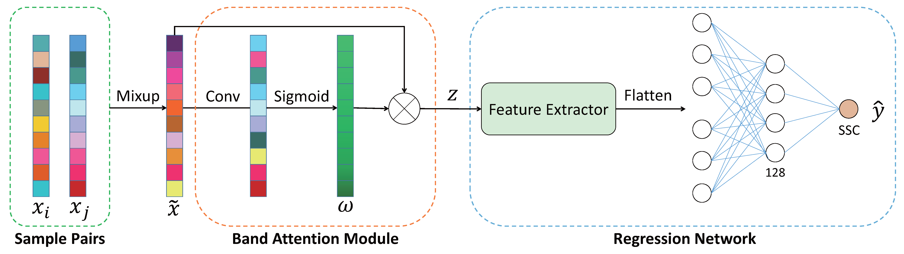

### MBA-2023

#### Paper Introduction

**Title**: A Quantitative Spectra Analysis Framework Combining Mixup and Band Attention for Predicting Soluble Solid Content of Blueberries.

The original paper can be found at https://doi.org/10.1007/978-3-031-40292-0_30.

**Abstract**: Hyperspectral imaging can rapid and non-destructive monitor physical characteristics and intrinsic
chemical information of food. In recent years, many studies have applied hyperspectral imaging to evaluate the internal quality
of fruits. However, due to the influence of environmental factors, there are abnormal samples in the collected data.
Furthermore, the model faces challenges such as limited data availability and insufficient diversity in the dataset. In
this study, we collected a total of 1010 hyperspectral images of blueberries and measured their soluble solid content (
SSC). To reduce the influence of abnormal samples and increase the diversity of samples, we propose a deep learning
framework combining mixup and band attention to predict blueberry SSC. The mixup module performs data augmentation on
both spectra and SSC values, enhancing sample diversity and improving the generalization performance of the model. The
band attention module captures cross-band information and learns band weights, enabling the model to focus on the bands
relevant to SSC. Furthermore, we find that bands with higher weights are consistent with SSC-sensitive bands in existing
knowledge, which improves the interpretability of the model.

**MBA framework**:


#### Requirements

> requirements.txt

#### Description of each Python file

```python
"""
--MBA-2023/
----checkpoints/
----data/
----images/
----logger/: Output experimental results, yaml files, logs
----models/: 
--------ablation_1.py
--------ablation_2.py
--------MBA.py
--------mix.py: mixup module
--------model_loader.py
----plot/: 
--------PLOT.py: plot utils
----calculate_band_weight.py: Load the pre trained model, calculate the average weight of each band, and draw a graph
----calculate_result.py: Load yaml file to calculate experimental results
----config.py: Hyperparameter configuration
----dataloader.py: Read data, define Dataset classes, load DataLoaders, etc
----init.py
----load_model_for_test.py: Load the pre trained model
----main.py
----metrics.py: Calculate regression evaluation indicators(R2/MSE/...)
----schedulers.py
----utils.py
----yaml_utils.py
"""
```

#### Data format

| Brix | Hardness | 393.7nm | ... | 1001.4nm |
|------|----------|---------|-----|----------|
| 8.0  | 3.0      | 0.1571  | ... | 0.1392   |
| 11.0 | 4.0      | 0.1606  | ... | 0.1438   |
| ...  | ...      | ...     | ... | ...      |

The first column represents Brix (soluble solid content), the second column represents hardness, and the other columns
represent different bands. Each row represents a sample, and the values from the third to last columns represent the
reflectance in that band. In the data folder we present some sample data.

#### How to Run Your Own Data

For your own data, you need to customize the function in **dataloader.py ->read_single_csv_data**.
And make corresponding modifications to other relevant parts(**config.py -> Constant.train_csv_path_list, etc.**).

#### Citation

If you use this code, or otherwise found our work valuable, please cite:

```latex
TBD
@inproceedings{MBA,
  title={A Quantitative Spectra Analysis Framework Combining Mixup and Band
Attention for Predicting Soluble Solid Content of Blueberries},
  author={Zhaokui Li, Jinen Zhang, Wei Li, Fei Li, Ke Bi, and Hongli Li},
  booktitle={},
  year={2023}
}
```

